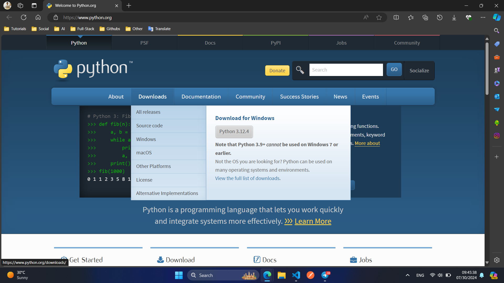
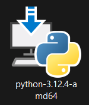
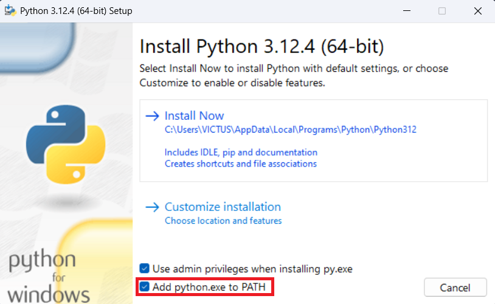
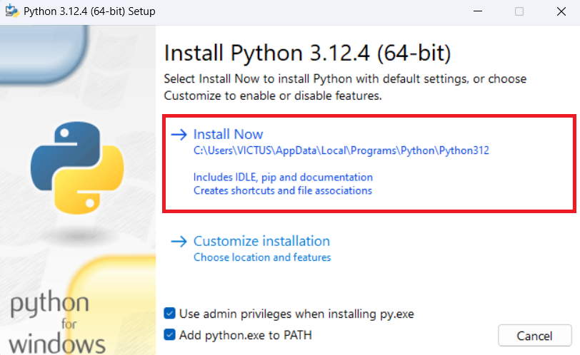
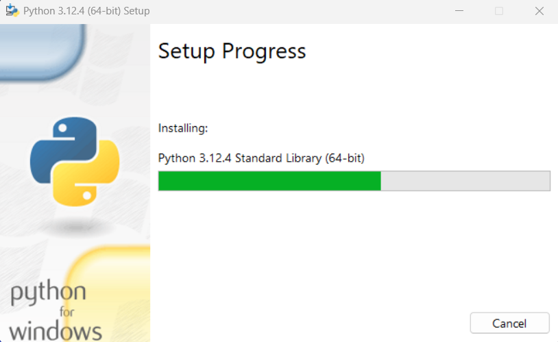
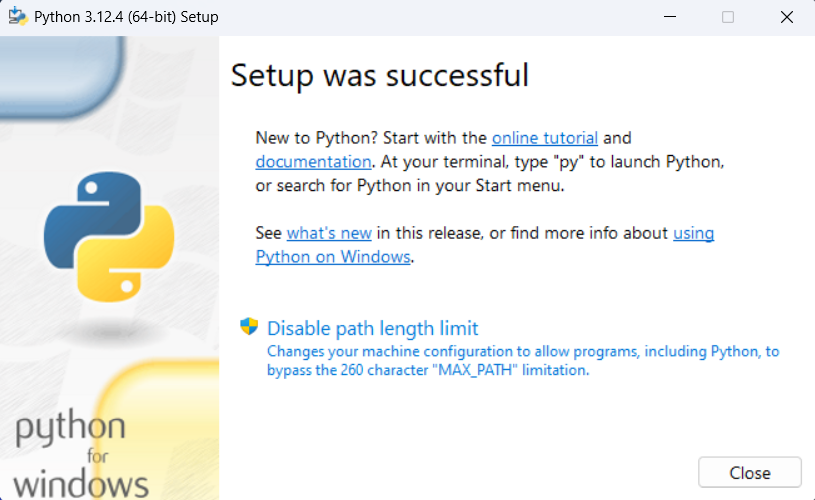
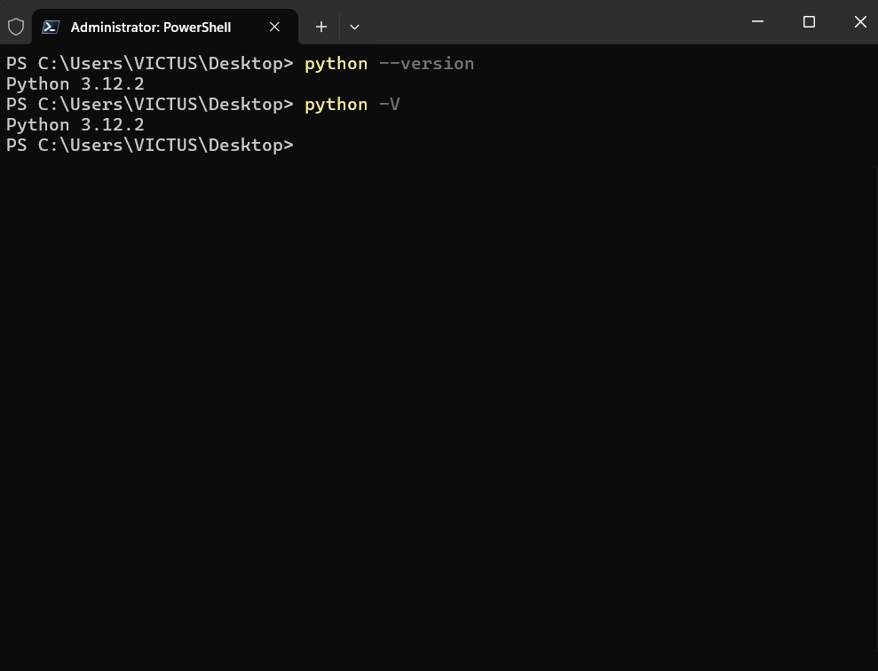

# PYTHON DASTURLASH ASOSLARI

- Mavzular
    - Python nima va u qanday ishlaydi?
    - Python muhiti va o'rnatish.
    - `Hello, World!` dasturini yozish.

>[!NOTE] 
> **Python** — `yuqori darajadagi`, `umumiy maqsadli` dasturlash tili bo‘lib, o‘zining `oson o‘qilishi` va `tushunarli sintaksisi` bilan mashhur. 1980-yillarning oxirida `Guido van Rossum` tomonidan ishlab chiqilgan va birinchi marta 1991-yilda chiqarilgan. Python bugungi kunda keng qo‘llaniladi, chunki u turli xil sohalarda ishlash imkoniyatini beradi.

### Pythonning asosiy xususiyatlari:
- **Sodda va tushunarli sintaksis:** Pythonning sintaksisi boshqa dasturlash tillariga qaraganda `osonroq` va `tushunarliroq`, shuning uchun yangi boshlovchilar uchun juda qulay.

- **Interpretatorlangan til:** Python interpretator orqali bajariladi, ya'ni kod yozilganidan so‘ng darhol ishlatilishi mumkin, kompilyatsiya talab qilinmaydi.

- **Ko‘p platformaliligi:** Python ko‘pgina operatsion tizimlarda ishlaydi, masalan, `Windows`, `MacOS`, va `Linux`.

- **Keng kutubxona to‘plamlari:** Pythonda ko‘plab tayyor kutubxonalar mavjud bo‘lib, ular turli sohalarda, masalan, `veb-dasturlash`, `ilmiy hisob-kitoblar`, `sun’iy intellekt` va boshqalarda qo‘llaniladi.

- **Obyektga yo‘naltirilgan dasturlash:** Python obyektga yo‘naltirilgan dasturlashni qo‘llab-quvvatlaydi, bu esa katta dasturlarni tuzishni osonlashtiradi.

- **Moslashuvchan va kengaytirilishi mumkin:** Pythonni boshqa tillar bilan birlashtirish yoki maxsus kutubxonalar orqali kengaytirish mumkin.


### Python qanday ishlaydi?

- **Kodni yozish:** Dastlab, dasturchi `.py` kengaytmali fayllarda `Python` kodini yozadi.
- **Interpretator orqali bajarish:** Yozilgan kod `Python interpretatori` yordamida bevosita bajariladi. Masalan, `python script.py` buyrug‘ini kiritish orqali.
- **Bytecodega aylantirish:** `Python interpretatori` dastlab `Python` kodini `bytecodega` aylantiradi (`.pyc` fayllari). Bu jarayon tezroq ishlashga yordam beradi.
- **PyVMda bajarish:** Bytecode Python Virtual Mashinasida `(PyVM)` bajariladi. `PyVM` bytecodeni mashina kodi (kompyuter tushunadigan til) ga aylantiradi va operatsion tizim orqali bajaradi.


### Pythonning qo‘llanish sohalari:

- **Veb-dasturlash:** [Django](https://www.djangoproject.com/), [Flask](https://flask.palletsprojects.com/en/3.0.x/) kabi freymvorklar orqali veb-saytlar va veb-ilovalar yaratish.
- **Ilmiy hisob-kitoblar va ma'lumotlar tahlili:** [NumPy](https://numpy.org/), [pandas](https://pandas.pydata.org/), [SciPy](https://scipy.org/), [matplotlib](https://matplotlib.org/) kabi kutubxonalar yordamida.
- **Sun'iy intellekt va mashinani o‘rganish:** [TensorFlow](https://www.tensorflow.org/), [Keras](https://keras.io/), [PyTorch](https://pytorch.org/) kabi kutubxonalar yordamida.
- **Avtomatlashtirish va skript yozish:** Turli xil vazifalarni avtomatlashtirish uchun.
- **O'yin dasturlash:** [Pygame](https://www.pygame.org/news) kabi kutubxonalar yordamida.


### Python Muhiti va O‘rnatish:
>[!NOTE]
> Python dasturlash tilida dasturlashni boshlash uchun sizga Python interpretatorini kompyuteringizga o‘rnatish kerak bo‘ladi. Pythonning rasmiy veb-saytida Pythonning oxirgi versiyasini yuklab olish mumkin. Shuningdek, muhitni boshqarish va kod yozish uchun turli vositalar va muharrirlar mavjud.

#### Python O‘rnatilishi:
Windows
1. Pythonni yuklab olish:
    - [Pythonni rasmiy web-saytiga](https://www.python.org/) kiring.
    - `Downloads` bo‘limiga o‘ting va `Windows` uchun oxirgi barqaror versiyasini yuklab oling.

    

2. Pythonni o‘rnatish:
    - Yuklab olingan `.exe` faylini ishga tushiring.

    

    - `Add Python to PATH` katagiga belgi qo‘ying. Bu belgi Python'ni kompyuteringizdagi barcha joylarda ishlatishga imkon beradi.

    

    - `Install Now` tugmasini bosing va o‘rnatishni yakunlang.

    

    - Indikator to'lishini kutamiz.

    

    - `Setup was successfull` muvaffaqiyatli o'rnatildi.

    

3. O‘rnatishni tekshirish:
    - `Command Prompt` yoki `PowerShell`ni oching.
    - `python --version` yoki `python -V` buyrug‘ini kiriting. Bu sizga o‘rnatilgan Python versiyasini ko‘rsatadi.

    

### `Hello, World!` dasturini yozish.
```python
print("Hello World!")
```

## AMALIYOT
- `Python` interpreterini o'rnatish.
- `Hello, World!` dasturini yozish va ishga tushirish.
- `print()` funksiyasi yordamida turli xabarlarni chiqarish.