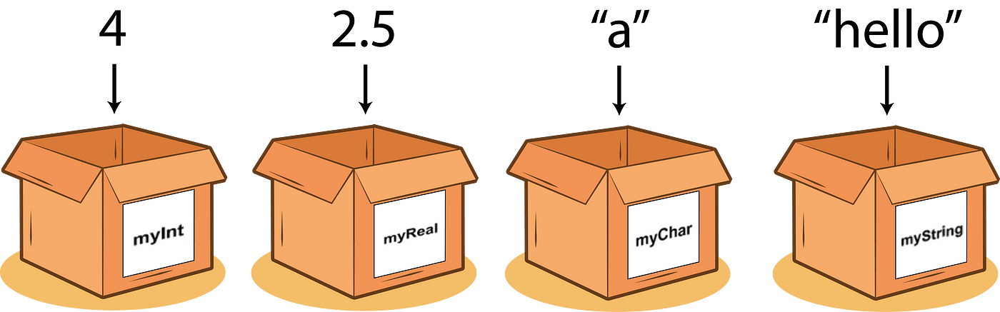
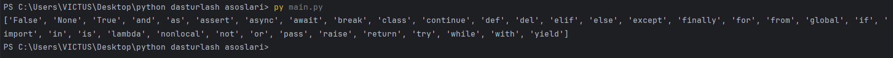
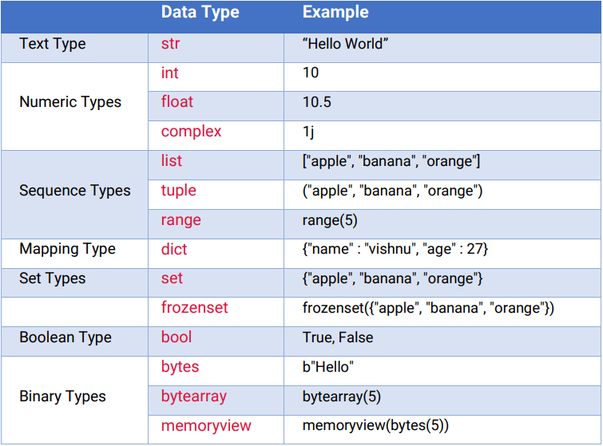

# PYTHON DASTURLASH ASOSLARI

## 1-dars O'zgaruvchilar va ma'lumot turlari.

- Mavzular:
    - O'zgaruvchilar, ma'lumot turlari (int, float, str, bool).
    - O'zgaruvchilarni e'lon qilish va ularga qiymat berish.

>[!NOTE]
> Python dasturlash tilida o'zgaruvchilar va ma'lumot turlari dasturlarni tuzishda juda muhim. Quyida o'zgaruvchilar va ularning turli ma'lumot turlari haqida ma'lumot beriladi.

## O'ZGARUVCHILAR

**O'zgaruvchi** - kompyuter xotirasida ma'lum bir qiymatni saqlash uchun ajratilgan joy. `Python`da o'zgaruvchi yaratish va unga qiymat berish juda oson:



Quyidagi misolda 4 ta o'zgaruvchi yaratdik (`x`, `y`, `name` va `is_student`) va ularga har xil ma'lumot yukladik.

```python
x = 5 # Butun son (int)
y = 3.14 # Haqiqiy son (float)
name = "Alice"  # Matn (str)
is_student = True  # Mantiqiy qiymat (bool)
print(x)
print(y)
print(name)
print(is_student)
```

Natija: <br>
`5` <br>
`3.14` <br>
`Alice` <br>
`True`

O'zgaruvchi (variable) diyilishini sababi uning qiymati istalgan payt o'zgarishi mumkin:

```python
ism = 'Alisher'
print(ism)
ism = "Muhammad"
print(ism)
```

Natija: <br>
`Alisher` <br>
`Muhammad`

Yuqoridagi misolda `ism` nomli o'zgaruvchiga avval `Alisher` keyin esa `Muhammad` deb qiymat berdik.

### O'ZGARUVCHILARNI NOMLASH
> [!CAUTION]
> O'zgaruvchilarga nom berishda quyidagi qoidalarga amal qiling:
> - O'zgaruvchi nomi harf yoki pastki chiziq (`_`) bilan boshlanishi kerak
> - O'zgaruvchi nomi raqam bilan boshlanishi mumkin emas
> - O'zgaruvchi nomida faqatgina lotin alifbosi harflari (`A-z`), raqamlar (`0-9`) va pastki chiziq (`_`) qatnashishi mumkin
> - O'zgaruvchi nomida bo'shliq (пробел) bo'lishi mumkin emas
> - O'zgaruvchi nomida katta-kichik harflar turlicha talqin qilinadi (`ism`, `ISM`, va `Ism` uchta turli o'zgaruvchi)

Qo'shimcha qoidalar:
- O'zgaruvchi nomini kichik harflar bilan yozing.
- O'zgaruvchi nomida 2 va undan ortiq so'z qatnashsa ularning orasini pastki chiziq (`_`) bilan ajrating (`ism_sharif="Umid G'aybullayev"`) 
- O'zgaruvchiga tushunarli nom bering (`y=20` emas `yosh=20`, `d="Korea"` emas `davlat = "Korea"` va hokazo)
- Shuningdek o'zgaruvchilarga Pythonda ishlatiladigan funktsiyalar va maxsus kalit so'zlarning (keywords) nomini bermang. Kalit so'zlar ro'yhatini ko'rish uchun python faylga  uyidagi kodni yozamiz:
```python
import keyword
print(keyword.kwlist)
```
Marhamat, ekraningizda Pythondagi maxsus kalit so'zlar ro'yhatini ko'ryapsiz:


## MA'LUMOT TURLARI
Python dasturlash tilida 7ta ma'lumot turi bor, ular quyidagilar:



## STRING

- **String(str)** - Matnli ma'lumotlarni ifodalaydi. Masalan: `"hello"`, `'world'`, `"123"`.
    ```python
    # ikkitalik qo'shtirnoqlar bilan
    text = "Hello world"

    # bittalik qo'shtirnoqlar bilan
    text = 'Hello world'

    # Ko'p qatorli stringlar uchlik qo'shtirnoqlar bilan
    text = """This is a
    multiline string."""

    text = '''This is also a
    multiline string.'''
    ```
    ### STRING USTIDA AMALLAR
    Matnlarni qo'shish uchun `+` operatoridan foydalanamiz.
    ```python
    ism = "Umid"
    print("Mening ismim " + ism)
    ```
    **Natija:** `Mening ismim Umid`
    ```python
    ism = "Umid"
    familiya = "G'aybullayev"
    print(ism + familiya)
    ```
    **Natija:** `UmidG'aybullayev` <br>
    Yuqoridagi kodimizda ism va familiya qo'shilib qoldi, uni to'g'irlash uchun quyidagi ko'rinishda yozamiz:
    ```python
    ism = "Umid"
    familiya = "G'aybullayev"
    print(ism + ' ' + familiya)
    ```
    **Natija:** `Umid G'aybullayev`

    ### STRING UZUNLIGINI ANIQLASH
    Matnlarimizni uzunligini topish uchun `len()` funksiyasidan foydalanamiz.
    ```python
    text = "Hello, World!"
    uzunlik = len(text)  # 13
    print(uzunlik)
    ```
    **Natija:** `13`

    ### STRING E'LEMENTLARIGA MUROJAT QILISH
    Matnlarimiz ichidan o'zimizga kerak bo'lgan harflarni ajratib olish uchun quyidagi usuldan foydalanamiz:
    ```python
    text = "Hello world!"
    first_char = text[0] # H
    last_char = text[-1]  # '!'
    substring = text[0:5]  # 'Hello'
    print(first_char)
    print(last_char)
    print(substring)
    ```
    **Natija:** <br>
    `H` <br>
    `!` <br>
    `Hello`

    ### STRINGLARNI KO'PAYTIRISH
    ```python
    text = "Hello"
    text_repeated = text * 3
    print(text_repeated)
    ```
    **Natija:** `HelloHelloHello`

    ### F-STRING(Python 3.6+)
    ```python
    ism = "Umid"
    yosh = 20
    text = f"Mening ismim {ism}, yoshim {yosh}da" #Mening ismim Umid, yoshim 20da
    print(text)
    ```
    **Natija:** `Mening ismim Umid, yoshim 20da`

    ### STRING METODLARI
    Python dasturlash tilida, stringlar ustida turli xil operatsiyalarni bajarish uchun bir qancha o'rnatilgan metodlar mavjud. Quyida eng ko'p qo'llaniladigan string metodlari va ularning misollari keltirilgan:

1. `.upper()` - Matndagi barcha harflarni katta harfga aylantiradi.

    ```python
    text = "hello"
    print(text.upper()) #HELLO
    ```
2. `.lower()` - Matndagi barcha harflarni kichik harfga aylantiradi.

    ```python
    text = "HELLO"
    print(text.lower()) #hello
    ```
3. `.capitalize()` - Matnning birinchi harfini katta harfga, qolganlarini kichik harfga aylantiradi.

    ```python
    text = "hello world"
    print(text.capitalize()) # Hello world
    ```
4. `.title()` - Matndagi har bir so'zning birinchi harfini katta harfga aylantiradi.

    ```python
    text = "hello world"
    print(text.title()) # Hello World
    ```
5. `.strip()` - Matnning boshida va oxiridagi bo'sh joylarni olib tashlaydi.

    ```python
    text = "    hello world    "
    print(text.strip()) # "hello world"
    ```
6. `.lstrip()` - Matnning faqat boshidagi bo'sh joylarni olib tashlaydi.

    ```python
    text = "    hello world    "
    print(text.lstrip()) # "hello world    "
    ```
7. `.rstrip()` - Matnning faqat oxiridagi bo'sh joylarni olib tashlaydi.

    ```python
    text = "    hello world    "
    print(text.rstrip()) # "    hello world"
    ```
8. `.replace()` - Matndagi ma'lum bir qatorni boshqa qator bilan almashtiradi.

    ```python
    text = "hello world"
    print(text.replace("world", "Python"))  # "hello Python"
    ```
9. `.split()` - Matnni ma'lum bir ajratgich bo'yicha qismlarga ajratadi va `ro'yxat` qaytaradi.

    ```python
    text = "hello world"
    print(text.split()) # ['hello', 'world']
    ```
10. `.join()` - Ro'yxatdagi elementlarni birlashtiradi va `string` qaytaradi.

    ```python
    words = ['hello', 'world']
    print(" ".join(words))  # "hello world"
    ```
11. `.find()` - Matn ichida ma'lum bir qatorni qidiradi va uning indeksini qaytaradi. Agar topilmasa, `-1` qaytaradi.
    ```python
    text = "hello world"
    print(text.find("world"))  # 6
    ```
12. `.startswith()` - Matn ma'lum bir qator bilan boshlanishini tekshiradi. `True` yoki `False` qaytaradi.
    ```python
    text = "hello world"
    print(text.startswith("hello"))  # True
    ```
13. `.endswith()` - Matn ma'lum bir qator bilan tugashini tekshiradi. `True` yoki `False` qaytaradi.
    ```python
    text = "hello world"
    print(text.endswith("world"))  # True 
    ```

## NUMBER

- **Number** - Raqamli ma'lumot turi 2ga bo'linadi:
    - **Integer(int)** - Butun sonlarni ifodalaydi. Masalan: `10`, `-3`, `42`.
    Integer ma'lumot turi butun sonlarni ifodalaydi. Bu sonlar `manfiy`, `musbat` yoki `0` bo'lishi mumkin. Integerlar cheklanmagan uzunlikka ega, ya'ni Python juda katta sonlarni ham integer sifatida saqlay oladi.

    ```python
    x = 10
    y = -5
    z = 0
    a = 12345678901234567890

    print(type(x))  # <class 'int'>
    print(type(y))  # <class 'int'>
    print(type(z))  # <class 'int'>
    print(type(a))  # <class 'int'>
    ```
    ### INTEGER OPERATSIYALARI
    Integerlar ustida asosiy matematik operatsiyalarni bajarish mumkin:
    ```python
    a = 10
    b = 3

    print(a + b)  # Qo'shish: 13
    print(a - b)  # Ayirish: 7
    print(a * b)  # Ko'paytirish: 30
    print(a / b)  # Bo'lish: 3.3333333333333335
    print(a // b) # Butun qismini olish: 3
    print(a % b)  # Qoldiqni olish: 1
    print(a ** b) # Darajaga ko'tarish: 1000
    ```

    ### UZUN SONLARNI KIRITISH
    Uzun sonlarni kiritishda, qulaylik uchun, raqamlarni pastki chiziq (`_`) yordamida guruhlash mumkin. Python - son tarkibidagi pastki chiziqlarni (`_`) inobatga olmasdan, uzun sonligicha qabul qiladi.

    ```python
    aholi_soni = 7_594_000_000 # o'qishga qulay bo'lishi uchun shunaqa ko'rinishda yozdik
    print("Yer sharida", aholi_soni, "ga yaqin odam yashaydi")
    ```

    ### KONSTANTA

    Aksar dasturlash tillarida `konstant` qiymatlar tushunchasi bor. Konstantlar o'zgarmas bo'ladi (misol uchun `π` ning qiymati konstant, o'zgarmas qiymat). Pythonda konstant tushunchasi yo'q, shuning uchun dasturchilar bunday o'zgaruvchilarning nomini katta harflar bilan yozadilar (`ogohlantirish sifatida`). Bu albatta qat'iy qonun emas, lekin kelajakda o'zgaruvchilar orasida konstant qiymatlarni ajratish uchun yaxshi usul.

    ```python
    PI = 3.14159
    radius = 20.7
    ```

    ### BIR NECHTA O'ZGARUVCHIGA QIYMAT BERISH
    Birdaniga bir nechta o'zgaruvchiga qiymat berish uchun o'zgaruvchilar va ularga mos qiymatlar vergul (`,`) bilan ajratiladi:
    ```python
    x, y, z = 10, -7.25, -30
    ```

    ### O'ZGARUVCHI TURINI ALMASHTIRISH

    Python dasturlash tilida o'zgaruvchilar turini bir ma'lumot turidan boshqa ma'lumot turiga o'zgartirish uchun turli xil funksiyalar mavjud. Ushbu jarayon tur o'zgartirish (`type casting`) deb ataladi. Quyida integer, float va string ma'lumot turlarini o'zaro o'zgartirish usullari haqida batafsil ma'lumot keltirilgan.

    #### Integerda Floatga o'zgartirish

    ```python
    x = 10
    y = float(x)  # 10.0

    print(type(y))  # <class 'float'>
    print(y)        # 10.0
    ```

#### Floatdan Integerga o'zgartirish
> [!NOTE]
> Floatni Integerga o'zgartirishda kasr qismini olib tashlaydi.

    ```python
    x = 3.14
    y = int(x)  # 3

    print(type(y))  # <class 'int'>
    print(y)        # 3
    ```

#### Stringdan Floatga o'zgartirish

> [!CAUTION]
> Stringni integerga o'zgartirish uchun string faqat raqamlarni o'z ichiga olishi kerak.

```python
s = "123"
x = int(s)  # 123

print(type(x))  # <class 'int'>
print(x)        # 123
```

#### Integerdan Stringga o'zgartirish

```python
x = 123
s = str(x)  # "123"

print(type(s))  # <class 'str'>
print(s)        # "123"
```

#### Floatdan Stringga o'zgartirish

```python
x = 3.14
s = str(x)  # "3.14"

print(type(s))  # <class 'str'>
print(s)        # "3.14"
```

### INPUT
Foydalanuvchidan ma'lumot olish uchun input() funksiyasidan foydalanamiz:

```python
ism = input("Ismingizni kiriting: ")
print(ism)
```

Yuqoridagi kodda foydalanuvchidan ism kiritishini so'radik va kiritilgan ismni terminalga chiqardik.

Input funksiyasidan foydalanishni o'rgandik, endi shu funksiya yordamida foydalanuvchidan son olishni o'rganamiz:

```python
#1 foydalanuvchining tug'ilgan yilini so'raymiz
t_yil = input("Tug'ilgan yilingizni kiriting: ")
#2 foydalanuvchi yoshini xisoblaymiz
yosh = 2020 - t_yil # 
#3 foydalanuvchi yoshini konsolga chiqaramiz
print("Siz " + yosh + " yoshda ekansiz")
```

    - **Floating Point(float)** - O'nlik sonlarni ifodalaydi. Masalan: `3.14`, `-2.7`,` 0.99`.

> [!NOTE]
> Pythonda o'nlik sonlar `floating point numbers` yoki qisqa qilib `floats` deyiladi. **"Floating point numbers"** atamasini o'zbek tiliga **"suzuvchi nuqtali sonlar"** deb tarjima qilish mumkin. Ingliz tilida o'nlik sonlarni yozishda vergul (`,`) emas nuqta (`.`) belgisi ishlatiladi, va bu nuqta sonning katta kichikligiga qarab joyi o'zgargani uchun **"floating"** (`suzuvchi`) deyiladi.

```python
pi = 3.14159 # o'nlik son (float)
radius = 10  # butun son (integer)
diametr = 2*radius
print("Aylana uzunligi ", pi*diametr, " ga teng.")
```

- Pythonda `sequence types` (ketma-ketlik) ma'lumot turlari turli xil elementlarni tartiblangan shaklda saqlash uchun ishlatiladi. Asosiy `sequence` turlari quyidagilar:
    - **List(list):** Tartiblangan va o'zgaruvchan ma'lumotlar to'plami. Masalan: `my_list = [1, 'Hello', True, '5.6']`
    - **Tuple(tuple):** Tartiblangan, lekin o'zgarmas ma'lumotlar to'plami. Masalan: `my_tuple = (1, 2, 3, 4, 5)`
    - **Range(range):** `Ketma-ket` sonlar intervalini ifodalaydi. Masalan: `range(1, 11)`
- Pythonda `mapping types` ma'lumot turi `kalit-qiymat` juftlari ko'rinishida ma'lumotlarni saqlash uchun ishlatiladi. Pythonda asosiy mapping ma'lumot turi bu **dictionary(dict)** hisoblanadi. `Dictionary` - kalit (`key`) va qiymat (`value`) juftlaridan tashkil topgan tartibsiz ma'lumotlar to'plami.
- Pythonda `set` - bu unikal elementlar to'plami bo'lib, `tartibsiz` va `indekslanmagan` holda saqlanadi. `Set` ma'lumot turi `duplikat` elementlarni o'z ichiga olmaydi va asosiy foydalanish maqsadi to'plam operatsiyalarini bajarish (`union`, `intersection`, `difference` va boshqalar) hisoblanadi.
    - Pythonda frozenset `o'zgarmas set` ma'lumot turi bo'lib, setning barcha xususiyatlariga ega, lekin elementlari yaratilgandan so'ng o'zgartirilmaydi.
- Pythonda `boolean(bool)` ma'lumot turi ikkita qiymatni ifodalaydi: `True` va `False`. `Boolean` ma'lumot turi mantiqiy ifodalarni baholash va shartli tekshiruvlarni amalga oshirish uchun ishlatiladi. 
- Pythonda `binary` ma'lumot turlari ikkilik (`binary`) ma'lumotlar bilan ishlash uchun ishlatiladi. Asosiy `binary` ma'lumot turlari quyidagilardan iborat:
    - **bytes:** O'zgarmas ikkilik ma'lumotlar to'plami.
    - **bytearray:** O'zgaruvchan ikkilik ma'lumotlar to'plami.
    - **memoryview:** Mavjud ikkilik ma'lumotlarni ko'rish va manipulyatsiya qilish imkonini beradi.

## AMALIYOT
1. Foydalanuvchidan ikkita son kiritishini so'rang va ularni qo'shing.