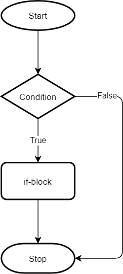
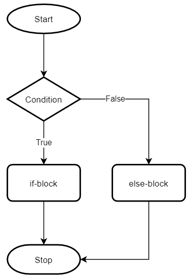
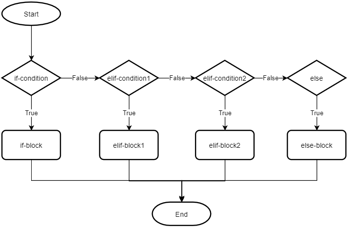

# PYTHON DASTURLASH ASOSLARI

## 6-dars Shart operatorlari

## TARMOQLANISH

Shu vaqtgacha yozgan dasturlarimizga e'tibor bersangiz, dasturimiz yuqoridan pastga qarab qatorma-qator bajarilib keldi. Bu chiziqli dastur deyiladi. Voqelikda esa aksar dasturlar ma'lum bir shart bajarilishi (yoki bajarilmaganiga) ko'ra kodning bir qismidan boshqa qismiga "sakrab" o'tishi tabiiy hol. Dasturlashda bu `tarmoqlanish` deb ataladi. 



Python dasturlash tilida shart operatorlari (`conditional statements`) dasturda turli vaziyatlarga qarab turli amallarni bajarishga imkon beradi.

## `if` OPERATORI
`if` operatori birinchi bo'lib shartni tekshiradi va agar shart bajarilsa, keyingi blokdagi kodni bajaradi.

**Sintaksis:**
```python
if shart:
    # Bu yerda shart bajarilganda bajariladigan kodlar
```
Quyidagi misolda `x` o'zgaruvchisiga berilgan qiymat `5` dan katta ekanligini tekshirdik, agar shart `True` bo'lsa terminalga `x 5 dan katta` degan so'z chiqadi:
```python
x = 10
if x > 5:
    print("x 5 dan katta")
```

Quyidagi misolda foydalanuvchidan yoshini kiritishi so'raladi, kiritilgan yosh `18` dan katta bo'lsa yoki `18` ga teng bo'lsa ovoz berish huquqi beriladi:
```python
age = input('Enter your age:')
if int(age) >= 18:
    print("You're eligible to vote.")
```

## `else` OPERATORI



Agar `if` sharti bajarilmasa, `else` blokidagi kod bajariladi.

**Sintaksis:**
```python
if shart:
    # Bu yerda shart bajarilganda bajariladigan kodlar
else:
    # Bu yerda shart bajarilmaganda bajariladigan kodlar
```
Quyidagi misolda `x` o'zgaruvchisiga berilgan qiymat `5` dan katta ekanligini tekshirdik. Agar shart `True` bo'lsa, terminalga `x` `5` dan katta degan so'z chiqadi. Aks xolda `x` `5` dan kichik yoki teng degan so'z chiqadi:
```python
x = 3

if x > 5:
    print("x 5 dan katta")
else:
    print("x 5 dan kichik yoki teng")
```

Quyidagi misolda foydalanuvchidan yoshini kiritishi so'raladi, kiritilgan yosh `18` dan katta bo'lsa yoki `18` ga teng bo'lsa ovoz berish huquqi beriladi. Aks xolda `18`dan kichik bo'lsa ovoz bera olmaysiz degan so'z chiqadi.
```python
age = input('Enter your age:')
if int(age) >= 18:
    print("You're eligible to vote.")
else:
    print("You're not eligible to vote.")
```
### LIST BILAN ISHLASH:
- Listning bo'sh yoki to'la ekanligini tekshirish:
```python
my_list = [1, 2, 3]

if my_list:  # Ro'yxat bo'sh bo'lmasa
    print("Ro'yxat to'la")
else:
    print("Ro'yxat bo'sh")
```
- Listda e'lement mavjud ekanligini tekshirish
```python
my_list = [1, 2, 3, 4, 5]
# Element mavjudligini tekshirish
if 3 in my_list:
    print("3 ro'yxatda mavjud")
else:
    print("3 ro'yxatda mavjud emas")

# Ro'yxat uzunligini tekshirish
if len(my_list) > 5:
    print("Ro'yxatdagi elementlar soni 5 dan ko'p")
else:
    print("Ro'yxatdagi elementlar soni 5 yoki undan kam")
```
- Bir nechta shartni tekshirish:
```python
my_list = [1, 2, 3, 4, 5]

if len(my_list) > 3 and 2 in my_list:  # Ro'yxat uzunligi 3 dan katta va 2 elementi mavjud bo'lsa
    print("Ro'yxatda 3 dan ortiq element va 2 elementi mavjud")
else:
    print("Shartlar bajarilmadi")
```

### TUPLE BILAN ISHLASH:
- Tupleni bo'sh yoki to'la ekanligini tekshirish:
```python
my_tuple = (1, 2, 3)

if my_tuple:  # Tuple bo'sh bo'lmasa
    print("Tuple to'la")
else:
    print("Tuple bo'sh")
```
- Tuple ichida e'lement mavjudligini tekshirish:
```python
my_tuple = (10, 20, 30, 40, 50)

# Element mavjudligini tekshirish
if 20 in my_tuple:
    print("20 tuplda mavjud")
else:
    print("20 tuplda mavjud emas")

# Tuple uzunligini tekshirish
if len(my_tuple) == 5:
    print("Tupledagi elementlar soni 5 ta")
else:
    print("Tupledagi elementlar soni 5 ta emas")
```
- Bir nechta shartni tekshirish
```python
my_tuple = (1, 2, 3, 4, 5)

if len(my_tuple) > 3 and 2 in my_tuple:  # Tuple uzunligi 3 dan katta va 2 elementi mavjud bo'lsa
    print("Tuple-da 3 dan ortiq element va 2 elementi mavjud")
else:
    print("Shartlar bajarilmadi")
```

### SET BILAN ISHLASH:
- Setning bo'sh yoki to'la ekanligini tekshirish:
```python
my_set = {1, 2, 3}

if my_set:  # Set bo'sh bo'lmasa
    print("Set to'la")
else:
    print("Set bo'sh")
```
- E'lement mavjud ekanligini tekshirish:
```python
my_set = {100, 200, 300, 400}

# Element mavjudligini tekshirish
if 300 in my_set:
    print("300 setda mavjud")
else:
    print("300 setda mavjud emas")
```
- Bir nechta shartni tekshirish:
```python
my_set = {1, 2, 3, 4, 5}

if len(my_set) > 3 and 2 in my_set:  # Set uzunligi 3 dan katta va 2 elementi mavjud bo'lsa
    print("Setda 3 dan ortiq element va 2 elementi mavjud")
else:
    print("Shartlar bajarilmadi")
```

### DICTIONARY BILAN ISHLASH:
- Dictionary bo'sh yoki to'la ekanligini tekshirish:
```python
my_dict = {"name": "Alice", "age": 25}

if my_dict:  # Dictionary bo'sh bo'lmasa
    print("Dictionary to'la")
else:
    print("Dictionary bo'sh")
```
- E'lement mavjud ekanligini tekshirish:
```python
my_dict = {'a': 1, 'b': 2, 'c': 3}

# Kalit mavjudligini tekshirish
if 'b' in my_dict:
    print("'b' kaliti lug'atda mavjud")
else:
    print("'b' kaliti lug'atda mavjud emas")

# Qiymat mavjudligini tekshirish
if 2 in my_dict.values():
    print("2 qiymati lug'atda mavjud")
else:
    print("2 qiymati lug'atda mavjud emas")
```
- Bir nechta shartni tekshirish:
```python
my_dict = {"name": "Alice", "age": 25, "city": "New York"}

if "age" in my_dict and my_dict["age"] > 20:  # "age" kaliti mavjud va qiymati 20 dan katta bo'lsa
    print("Yoshi 20 dan katta")
else:
    print("Shart bajarilmadi")
```
- Dictionary uzunligini tekshirish:
```python
my_dict = {"name": "Alice", "age": 25, "city": "New York"}

if len(my_dict) > 2:  # Dictionaryda 2 dan ortiq kalit mavjud bo'lsa
    print("Dictionaryda 2 dan ortiq kalit mavjud")
else:
    print("Dictionaryda 2 yoki undan kam kalit mavjud")
```


## `elif` OPERATORI



`elif` (**else if**) operatori ko'p shartlarni ketma-ket tekshirish uchun ishlatiladi. Agar birinchi shart `if` bajarilmasa, `elif` sharti tekshiriladi. Agar hech qaysi shart bajarilmasa, `else` bloki bajariladi.

**Sintaksis:**
```python
if shart1:
    # Bu yerda shart1 bajarilganda bajariladigan kodlar
elif shart2:
    # Bu yerda shart2 bajarilganda bajariladigan kodlar
else:
    # Bu yerda hech qaysi shart bajarilmaganda bajariladigan kodlar
```
Quyidagi misolda `x` o'zgaruvchisiga berilgan qiymat `10` dan katta ekanligini tekshirdik. Agar shart `True` bo'lsa, terminalga `x` `10` dan katta degan so'z chiqadi. Aksxolda agar `x` `5` dan katta bo'lsa `5` dan katta lekin `10` dan kichik yoki teng degna so'z chiqadi, aks xolda x `5` dan kichik yoki teng degan so'z chiqadi:
```python
x = 7

if x > 10:
    print("x 10 dan katta")
elif x > 5:
    print("x 5 dan katta lekin 10 dan kichik yoki teng")
else:
    print("x 5 dan kichik yoki teng")
```

```python
my_list = [1, 2, 3, 4, 5]

if len(my_list) == 0:
    print("Ro'yxat bo'sh")
elif len(my_list) > 0 and len(my_list) <= 3:
    print("Ro'yxatda 3 yoki undan kam element bor")
else:
    print("Ro'yxatda 3 dan ortiq element bor")
```

```python
my_tuple = (1, 2, 3, 4, 5)

if len(my_tuple) == 0:
    print("Tuple bo'sh")
elif len(my_tuple) > 0 and len(my_tuple) <= 3:
    print("Tuple-da 3 yoki undan kam element bor")
else:
    print("Tuple-da 3 dan ortiq element bor")
```

```python
my_set = {1, 2, 3, 4, 5}

if len(my_set) == 0:
    print("Set bo'sh")
elif len(my_set) > 0 and len(my_set) <= 3:
    print("Setda 3 yoki undan kam element bor")
else:
    print("Setda 3 dan ortiq element bor")
```
- Ikkita to'plamni solishtirish:
```python
set1 = {1, 2, 3}
set2 = {3, 4, 5}

if set1 == set2:  # Ikkala set bir xil bo'lsa
    print("Setlar teng")
elif set1 & set2:  # Ikkala setda umumiy elementlar bo'lsa
    print("Setlarda umumiy elementlar mavjud")
else:
    print("Setlarda umumiy elementlar yo'q")
```

```python
my_dict = {"name": "Alice", "age": 25}

if "name" not in my_dict:
    print("Ism kiritilmagan")
elif my_dict["age"] < 18:
    print("Yosh kichikroq")
else:
    print("Ism va yosh mos")
```


## SHARTLARNI ZANJIR ORQALI ULASH (`and`, `or`, `not`)

Siz shartlarni birgalikda ishlatishingiz mumkin, bu orqali bir nechta shartlarni birga tekshirish mumkin.
- `and`: Ikkala shart ham to'g'ri bo'lsa, shart bajariladi.
- `or`: Har qanday bir shart to'g'ri bo'lsa, shart bajariladi.
- `not`: Shartning qiymatini teskariga o'zgartiradi.

```python
x = 7
y = 10

if x > 5 and y > 5:
    print("x va y har ikkalasi ham 5 dan katta")
    
if x > 5 or y < 5:
    print("yoki x 5 dan katta yoki y 5 dan kichik")

if not (x > 10):
    print("x 10 dan katta emas")
```

## SHART OPERATORLARINI ICHMA-ICH JOYLASH (Nested Conditions)
Shart operatorlarini bir-birining ichiga joylashtirish orqali murakkabroq mantiqiy holatlar yaratish mumkin.

```python
x = 8

if x > 5:
    if x < 10:
        print("x 5 dan katta va 10 dan kichik")
    else:
        print("x 10 dan katta yoki teng")
else:
    print("x 5 dan kichik yoki teng")
```

- Ko'p darajali ichma-ich shart operatorlari:
```python
x = 10
y = 20
z = 30

if x > 5:  # Birinchi darajadagi shart
    if y > 15:  # Ikkinchi darajadagi shart
        if z > 25:  # Uchinchi darajadagi shart
            print("x 5 dan katta, y 15 dan katta, va z 25 dan katta")
        else:
            print("x 5 dan katta, y 15 dan katta, lekin z 25 dan kichik yoki teng")
    else:
        print("x 5 dan katta, lekin y 15 dan kichik yoki teng")
else:
    print("x 5 dan kichik yoki teng")
```

- Ichma-ich shart operatorlari bilan foydalanuvchi `login`, `parol`ini tekshirish:
```python
username = "admin"
password = "1234"

if username == "admin":  # Birinchi darajadagi shart
    if password == "1234":  # Ikkinchi darajadagi shart
        print("Tizimga kirdingiz!")
    else:
        print("Noto'g'ri parol!")
else:
    print("Noto'g'ri foydalanuvchi nomi!")
```

## AMALIYOT

- Sonning musbat, manfiy yoki nol ekanligini aniqlash.
    - Foydalanuvchi kiritgan sonning musbat, manfiy yoki nol ekanligini aniqlaydigan dastur yozing.
- Talabaning bahosini aniqlash:
    - Talabaning o'rtacha bahosi asosida uning bahosini aniqlaydigan dastur yozing. Shartlar quyidagicha bo'lsin:
        - 90 va undan yuqori: "A"
        - 80 va undan yuqori: "B"
        - 70 va undan yuqori: "C"
        - 60 va undan yuqori: "D"
        - 60 dan past: "F"
- Yilning faslini aniqlash:
    - Foydalanuvchi kiritgan oy raqami asosida qaysi fasl ekanligini aniqlaydigan dastur yozing:
        - 12, 1, 2 - Qish
        - 3, 4, 5 - Bahor
        - 6, 7, 8 - Yoz
        - 9, 10, 11 - Kuz
- Foydalanuvchi login tizimi:
    - Foydalanuvchi login va parol kiritadi, va tizim ularning to'g'ri yoki noto'g'ri ekanligini tekshiradi. Agar login "admin" va parol "1234" bo'lsa, tizimga kirish muvaffaqiyatli bo'ladi, aks holda xato xabarini chiqaradi.
- Sonning juft yoki toq ekanligini aniqlash.
    - Foydalanuvchi kiritgan sonning juft yoki toq ekanligini aniqlaydigan dastur yozing.